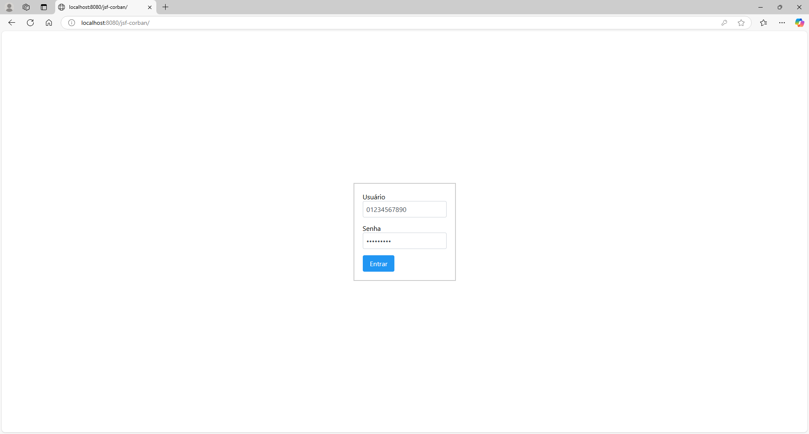
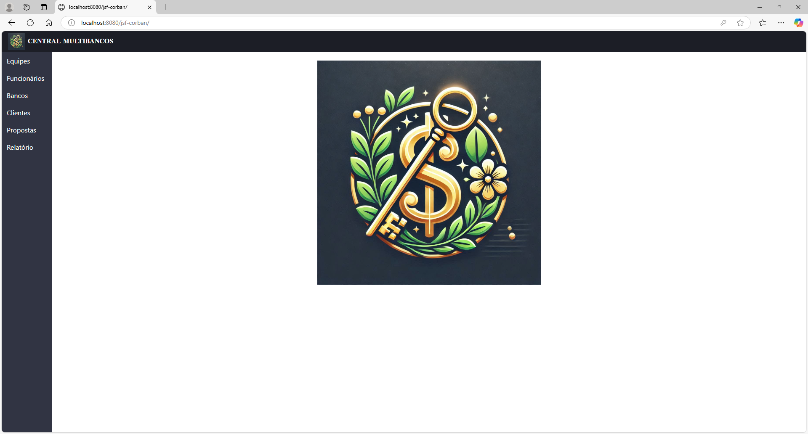
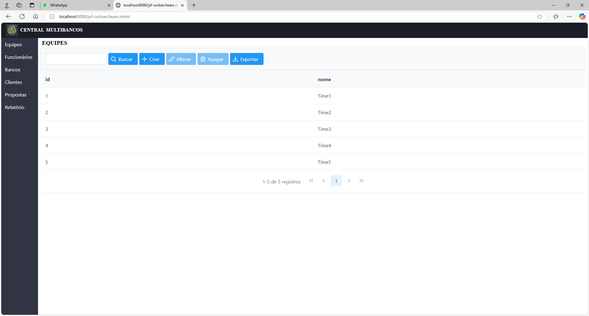
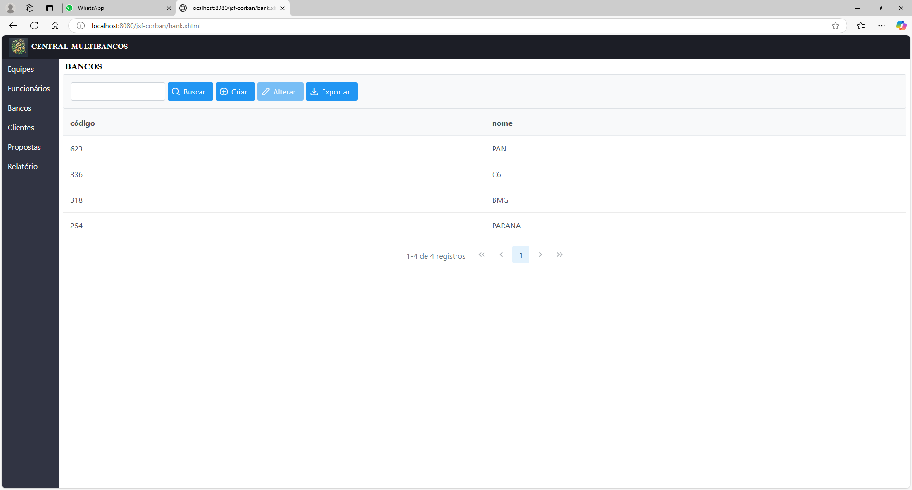
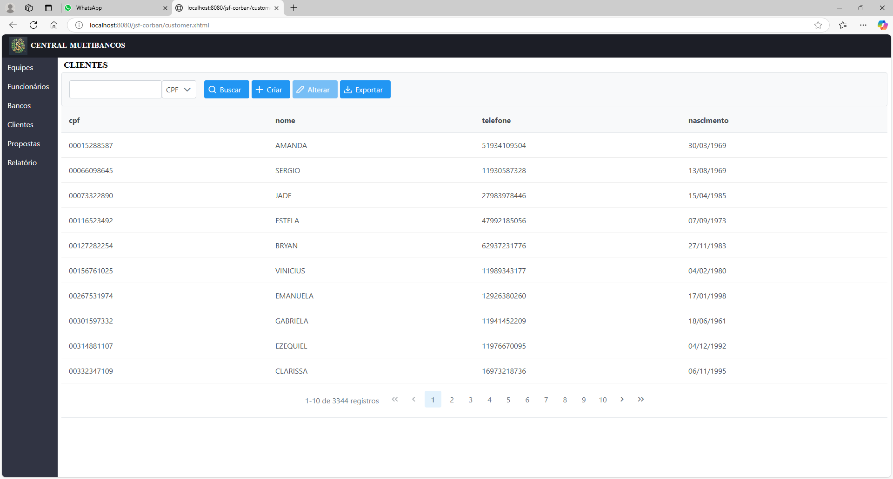
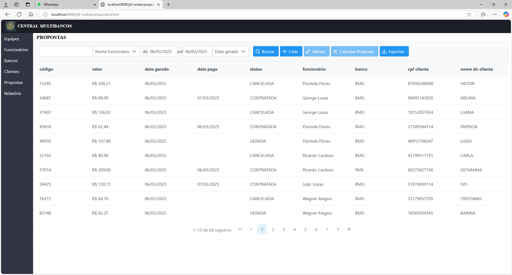
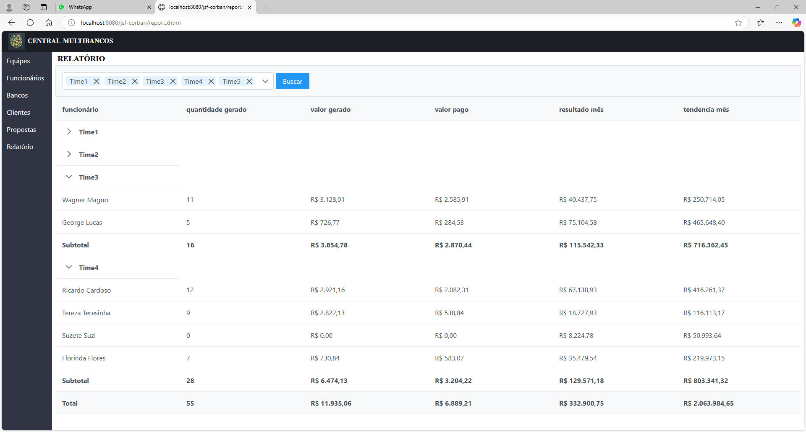

# Projeto JSF Corban Multibancos
A empresa Corban Multibancos atua como correspondente bancário na oferta de empréstimos de diversos bancos. O sistema deste projeto tem como objetivo permitir o armazenamento de propostas de empréstimo realizadas para clientes e um acompanhamento de resultado diário.

É necessário armazenar os dados da proposta e do cliente para formar uma carteira de clientes que futuramente serão retrabalhados na oferta de renovações de empréstimo. Sendo assim, quanto mais clientes existirem em carteira, mais negócios serão fechados pela empresa.

## Diagrama de caso de uso
 

O sistema possui dois tipos de usuários: gestor e consultor.

O gestor é encarregado de gerenciar os cadastros de equipes, bancos, funcionários e usuários do sistema, e gerar relatório de resultado diário. Ele pode também gerenciar o cadastro de clientes e propostas. O gestor possui acesso irrestrito a qualquer funcionalidade do sistema.

O consultor é responsável pelas negociações com clientes, podendo gerenciar os cadastros de clientes e propostas com algumas restrições de funcionalidade. Para facilitar o uso do sistema, é disponibilizado o cadastro de clientes na mesma tela do cadastro de propostas. Caso o cliente já tenha cadastro, os campos do formulário de cliente são preenchidos automaticamente, caso contrário, o consultor deve preencher os dados do cliente.

Ambos os usuários podem exportar os resultados de buscas para arquivo de extensão .csv, que possibilita a importação de dados em outros aplicativos especializados em análise de dados. O relatório é um conjunto de tabelas e subtabelas com campos total e subtotal, e inicialmente não pode ser exportado.

## Diagrama de classes

- As enumerações são armazenadas como texto para facilitar a manipulação.
- As equipes podem ser cadastradas livremente. Pode haver equipe sem funcionários.
- Os funcionários podem fazer parte de uma equipe ou não.
- Os bancos podem ser cadastrados livremente.
- Os clientes podem ser cadastrados livremente.
- As propostas precisam obrigatoriamente ter um funcionário responsável pela sua elaboração, um cliente a quem se destina a proposta e um banco que emprestará o dinheiro.

## Requisitos de software
Os requisitos funcionais do sistema podem ser encontrados no <a href="./documents/requisitos de software.docx">documento de requisitos</a>

## Tecnologias utilizadas
- Java
- Jakarta Faces
- Jakarta Persistence
- Jakarta Bean Validation
- Jakarta Security
- PrimeFaces

## Imagens do projeto em execução
Todos os dados utilizados foram gerados aleatoriamente usando ferramentas online e editores de planilha. Logomarca gerada por inteligência artificial.

------------------------------------------------------------

Tela de login

------------------------------------------------------------

Página inicial

------------------------------------------------------------

Tela de equipes

------------------------------------------------------------

Tela de funcionários

------------------------------------------------------------

Tela de bancos

------------------------------------------------------------

Tela de clientes

------------------------------------------------------------

Tela de propostas

------------------------------------------------------------

Tela de relatório

------------------------------------------------------------

Mensagem de validação de formulário

------------------------------------------------------------

Mensagem geral de erro

------------------------------------------------------------

Mensagem geral de informação

